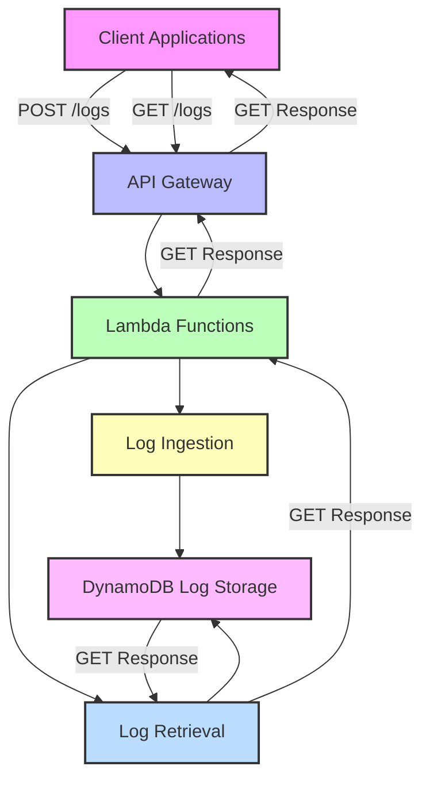

Serverless Log Service Application
Overview

This solution provides a fully serverless log management system with two core functions:

    Log Ingestion - Receives and stores log entries

    Log Retrieval - Returns the 100 most recent logs

The application is written in Python and managed as Infrastructure-as-Code (IaC) using Terraform.

Architecture

  # Serverless Log Service Architecture

Flow:
→ Log Ingestion Path: Writes log entries to DynamoDB via POST requests.

← Log Retrieval Path: Retrieves the 100 most recent logs from DynamoDB via GET request

Functionality

**1. Log Ingestion Function**

Endpoint: POST /logs

Purpose: Accepts log entries and stores them in DynamoDB.

Input Format:

    {
    "id": "unique-id-123",
    "datetime": "2023-11-15T12:05:00Z",
    "severity": "info|warning|error",
    "message": "Log content here"
    }

**2. Log Retrieval Function**
   
Endpoint: GET /logs

Purpose: Returns the 100 most recent log entries from DynamoDB.

Response Format:

    [
    {
    "id": "unique-id-124",
    "datetime": "2023-11-15T12:05:00Z",
    "severity": "warning",
    "message": "Disk space low"
    },
    ...
    ]

**Deployment Process**
    
Make Changes:
Update `write_log/ingest_logs.py` for ingestion logic.

Update `get_log/retrieve_logs.py` for retrieval logic.

Create a Pull Request:
Target the develop branch.

Add one of the following labels:

    deploy_log_ingest: For updates to the dev-log-ingest Lambda function.
    deploy_log_retrieval: For updates to the dev-log-retrieval Lambda function.

**Merge the Pull Request:**
Merging triggers the corresponding GitHub Actions workflow (.github/workflows/deploy-log-ingestion_dev.yml or .github/workflows/deploy-log-retrieval_dev.yml).

**Monitor Deployment:**
Check the Actions tab in the GitHub repository for workflow status.

Receive Slack notifications on success or failure.

**Requirements**
AWS Region: Ensure the region in the workflow files (default: us-east-1) matches your Lambda deployment region.

**GitHub Secrets:**
`AWS_ACCOUNT_ID`: Your AWS account ID.

`ROLE_NAME_GITHUB`: The IAM role for GitHub Actions authentication

**Maintenance Notes**
Infrastructure Management: All resources (Lambda, API Gateway, DynamoDB) are managed via Terraform in the log-service-terraform repo

