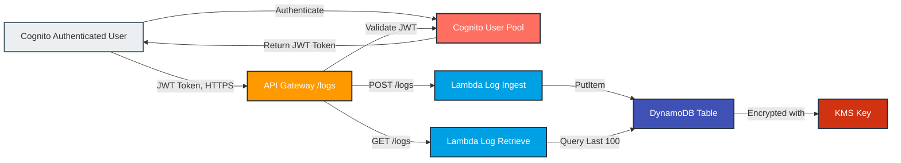

# AWS Serverless Logging Service

A serverless logging service built on AWS, utilizing API Gateway, Lambda, DynamoDB, Cognito, and KMS for secure log ingestion and retrieval.

## Overview

This service provides a scalable, secure solution for logging and retrieving messages via RESTful APIs. It uses AWS Cognito for authentication, API Gateway for routing, Lambda for processing, DynamoDB for storage, and KMS for encryption.

Architecture Components
- **API Gateway**: Secured with Cognito, exposes REST endpoints for logging
- **Lambda Functions**:
  - `write_log/ingest_logs.py`: Receives and stores log entries in DynamoDB
  - `get_log/retrieve_logs.py`: Retrieves the 100 most recent log entries
- **Cognito User Pool**: Handles authentication
- **DynamoDB Table**: Stores logs with encryption at rest
- **All infrastructure** managed via Terraform in `log-service-terraform/`
- **CI/CD** via GitHub Actions (with security checks and OIDC for AWS auth)

## Architecture





## Prerequisites

- **Python 3.12+**: Required for packaging Lambda functions.
- **jq**: For parsing JSON in CLI examples.
- **AWS CLI**: Configured with appropriate permissions.
- **Terraform**: For infrastructure deployment.

Deployment Instructions
1. Configure AWS Credentials
Ensure your AWS CLI is configured with credentials that have sufficient permissions (e.g., AdministratorAccess or specific IAM roles for Lambda, API Gateway, DynamoDB, Cognito, and KMS).

       aws configure

2. Package Lambda Functions
Package the Lambda functions for log ingestion and retrieval.


        # From the project root
       cd write_log
       zip ../log-service-terraform/ingest_logs.zip ingest_logs.py
       cd ../get_log
       zip ../log-service-terraform/retrieve_logs.zip retrieve_logs.py
       cd ..

3. Deploy Infrastructure with Terraform
Deploy the required AWS resources using Terraform.

       cd log-service-terraform
       terraform init
       terraform apply --var-file env/dev.tfvars
   Note the outputs for API URL and Cognito IDs.

4. Retrieve Initial Cognito Password
   
       aws secretsmanager get-secret-value --secret-id YOUR_SECRET_NAME

   Replace YOUR_SECRET_NAME with your actual secret name from Terraform outputs

5. First Login & Password Change

       # Start authentication (will require password change)
       AUTH=$(aws cognito-idp initiate-auth \
       --auth-flow USER_PASSWORD_AUTH \
       --client-id $COGNITO_CLIENT_ID \
       --auth-parameters USERNAME=$USERNAME,PASSWORD=$INITIAL_PASSWORD)

       # Extract session token
   
       SESSION=$(echo $AUTH | jq -r .Session)

       # Set new password
       aws cognito-idp respond-to-auth-challenge \
        --client-id $COGNITO_CLIENT_ID \
       --challenge-name NEW_PASSWORD_REQUIRED \
       --session "$SESSION" \
       --challenge-responses USERNAME=$USERNAME,NEW_PASSWORD=YourNewSecurePassword

       # Authenticate with new password
       AUTH=$(aws cognito-idp initiate-auth \
       --auth-flow USER_PASSWORD_AUTH \
       --client-id $COGNITO_CLIENT_ID \
       --auth-parameters USERNAME=$USERNAME,PASSWORD=YourNewSecurePassword)
       ID_TOKEN=$(echo $AUTH | jq -r .AuthenticationResult.IdToken)

   Note: Replace $COGNITO_CLIENT_ID, $USERNAME, and $TEMP_PASSWORD with the appropriate values. Use a secure password meeting Cognito’s requirements (e.g., minimum length, special characters).

6. Test API Endpoints
Use the JWT token (ID_TOKEN) obtained after authentication to test the API.


   
   Store a Log Entry

       curl -X POST "$API_URL/logs" \
       -H "Authorization: $ID_TOKEN" \
       -H "Content-Type: application/json" \
       -d '{"severity": "info", "message": "Test log entry"}'

   Retrieve Logs
   
       curl -X GET "$API_URL/logs" \
       -H "Authorization: $ID_TOKEN"

   Troubleshooting
Authentication Errors: Ensure the $COGNITO_CLIENT_ID and credentials are correct. Verify the user exists in the Cognito User Pool.

API Errors: Confirm the $API_URL is correct and the JWT token is valid (not expired).

Terraform Issues: Ensure AWS credentials have sufficient permissions.


## Architecture


```mermaid
flowchart LR
    A[Cognito Authenticated User]:::client
    B[Cognito User Pool]:::cognito
    C[API Gateway /logs]:::apigateway
    D[Lambda Log Ingest]:::lambda
    E[Lambda Log Retrieve]:::lambda
    F[DynamoDB Table]:::dynamodb
    G[KMS Key]:::kms

    A -->|Authenticate| B
    B -->|Return JWT Token| A
    A -->|JWT Token, HTTPS| C
    C -->|Validate JWT| B
    C -->|POST /logs| D
    C -->|GET /logs| E
    D -->|PutItem| F
    E -->|Query Last 100| F
    F -->|Encrypted with| G

    classDef client fill:#ECEFF1,stroke:#455A64,stroke-width:2px
    classDef cognito fill:#FF6F61,stroke:#232F3E,stroke-width:2px,color:#fff
    classDef apigateway fill:#FF9900,stroke:#232F3E,stroke-width:2px,color:#fff
    classDef lambda fill:#00A1E4,stroke:#232F3E,stroke-width:2px,color:#fff
    classDef dynamodb fill:#4051B5,stroke:#232F3E,stroke-width:2px,color:#fff
    classDef kms fill:#D13212,stroke:#232F3E,stroke-width:2px,color:#fff


